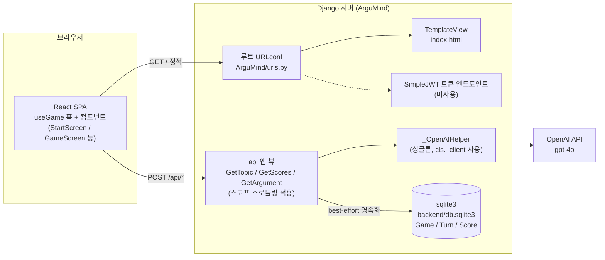
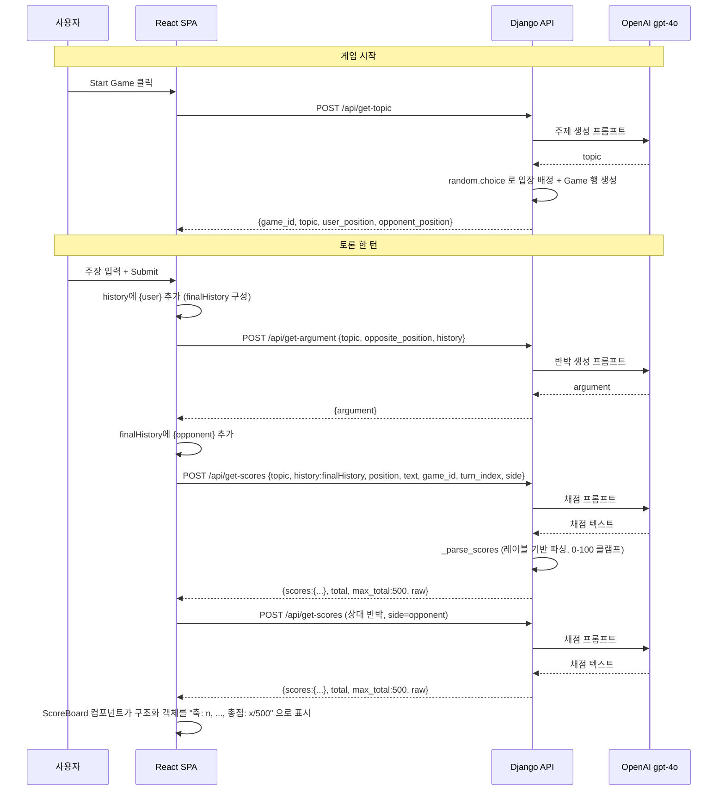

# ArguMind 아키텍처 문서

ArguMind는 AI 토론 게임입니다. 사용자는 AI가 생성한 주제에 대해 무작위로 찬성/반대 입장을 배정받아 AI 상대와 토론하며, 매 턴마다 사용자의 주장과 AI 상대의 반박을 심판 AI가 5개 축으로 0~100점씩 채점합니다.

본 문서는 시스템 구성 요소, 백엔드/프론트엔드 책임, 인증·CORS 구성, 데이터 영속성 현황, 구조적 부채를 정리합니다.

---

## 1. 시스템 구성 요소

ArguMind는 3계층으로 구성됩니다.

| 계층 | 기술 | 역할 |
| --- | --- | --- |
| 프론트엔드 | React 18.3 (CRA / react-scripts 5.0.1) | `useGame` 훅 + 7개 컴포넌트 SPA. 게임 상태 관리, 사용자 입력, 채팅 UI, 점수 표시 |
| 백엔드 | Django 5.1.3 + DRF 3.15.2 | REST API 3종 제공, React 빌드 정적 파일 서빙, OpenAI 호출 중개, 스코프 스로틀링 |
| 외부 LLM | OpenAI `gpt-4o` (openai 1.54.4) | 주제 생성, 상대 반박 생성, 채점 |

백엔드는 `backend/`, 프론트엔드는 `frontend/`로 분리되어 있습니다. 프론트엔드는 `SERVER_URL = process.env.REACT_APP_SERVER_URL || ""`(동일 출처)로 백엔드를 호출하고, 백엔드는 `frontend/build`의 `index.html`을 템플릿으로 서빙합니다(`backend/ArguMind/settings.py`의 `TEMPLATES.DIRS`, `STATICFILES_DIRS` — `REPO_ROOT` 기준으로 루트의 `frontend/build` 참조; `STATICFILES_DIRS`는 빌드 디렉터리가 실제로 존재할 때만 포함됩니다). 데이터베이스는 sqlite3(`backend/db.sqlite3`)이며 `Game` / `Turn` / `Score` 모델로 게임 기록을 저장합니다. get-topic 응답에 `game_id`와 서버 측 배정 입장(`user_position`, `opponent_position`)이 포함되어, 클라이언트가 더 이상 `Math.random()`으로 입장을 배정하지 않습니다.

### 컴포넌트 다이어그램



### 데이터 흐름 다이어그램 (한 턴의 토론)



---

## 2. 백엔드 모듈 책임

### 2.1 ArguMind 프로젝트 설정 (`backend/ArguMind/`)

- `settings.py` — Django 설정. `BASE_DIR`(= `backend/`)와 `REPO_ROOT`(= 그 부모, 루트의 `frontend/`를 찾기 위함)를 정의. `load_dotenv(os.path.join(BASE_DIR, '.env'))`로 `backend/.env`를 로드. `SECRET_KEY`는 오직 `DJANGO_SECRET_KEY` 환경변수에서만 읽으며 소스에 하드코딩 fallback이 없음(미설정 시 `DEBUG=True`는 `get_random_secret_key()`로 임시 키, `DEBUG=False`는 `ImproperlyConfigured` 예외). `DEBUG`는 `_env_bool('DJANGO_DEBUG', True)`, `ALLOWED_HOSTS`는 `DJANGO_ALLOWED_HOSTS` CSV 파싱. `INSTALLED_APPS`에 `rest_framework`, `api`, `corsheaders` 포함. `REST_FRAMEWORK`에 `DEFAULT_AUTHENTICATION_CLASSES`(`JWTAuthentication`), `DEFAULT_THROTTLE_CLASSES`(`ScopedRateThrottle`), `DEFAULT_THROTTLE_RATES`(get_topic/get_argument: 30/min, get_scores: 60/min — `DRF_THROTTLE_*` 환경변수로 재정의 가능) 설정. `MIDDLEWARE`는 8개 항목(중복 `CommonMiddleware` 제거됨). `DATABASES.NAME`은 `os.path.join(BASE_DIR, 'db.sqlite3')`(절대 경로). `STATICFILES_DIRS`는 `frontend/build/static`이 실제로 존재할 때만 포함.
- `urls.py` — 루트 URLconf. 정적 SPA 서빙, admin, SimpleJWT 토큰 엔드포인트, `api/` include.
- `wsgi.py` / `asgi.py` — 배포용 진입점.

### 2.2 api 뷰 3종 (`backend/api/views.py`)

세 뷰 모두 `APIView` 기반이며 `permission_classes = [AllowAny]`로 인증 없이 접근 가능합니다. 각 뷰는 `throttle_scope`를 설정해 DRF `ScopedRateThrottle`로 요청 횟수를 제한합니다.

- **`GetTopic`** (`throttle_scope='get_topic'`) — `post()`. 요청 본문 없음. 고정 프롬프트로 논쟁 주제 1개를 생성한 뒤, `random.choice`로 `user_position`/`opponent_position`을 배정하고 `Game` 행을 DB에 생성합니다. `{game_id, topic, user_position, opponent_position}` 반환.
- **`GetScores`** (`throttle_scope='get_scores'`) — `post()`. `request.data`에서 `topic`, `position`, `history`, `text`를 읽어(누락 시 400 `{error:"missing field: <name>"}`), 채점 프롬프트 구성 후 `temperature=0.7`로 호출. `_parse_scores(raw)`로 레이블 기반 파싱(각 0~100 클램프, 누락 축 → 0)하여 `{scores:{logical_consistency, relevance, creativity, rebuttal, summarization}, total, max_total:500, raw}` 반환. 요청에 `game_id`, `turn_index`, `side`가 있으면 `Turn`/`Score`를 best-effort로 영속화(실패해도 응답은 정상). 오류 시 `{error}` 400.
- **`GetArgument`** (`throttle_scope='get_argument'`) — `post()`. `topic`, `opposite_position`, `history`를 읽어(누락 시 400) 상대 입장의 반박 생성, `temperature=0.7`. `{argument}` 반환. 오류 시 `{error}` 400.

### 2.3 `_OpenAIHelper` 싱글톤 (`backend/api/views.py`)

- 클래스 속성 `_client`, `_is_loaded`로 1회 초기화를 보장하는 지연 싱글톤.
- `_load()` — `load_dotenv()` 후 `OpenAI(api_key=os.getenv('OPENAI_API_KEY'))`로 클라이언트 생성, `cls._client`에 저장, `_is_loaded = True`.
- `generate(system, prompt, temperature=0.9)` — 최초 호출 시 `_load()` 수행 후 **`cls._client.chat.completions.create(model='gpt-4o', ...)`** 로 system/user 2개 메시지를 전송하고 `response.choices[0].message.content.strip()` 반환. (이전에 모듈 전역 `openai`를 직접 호출하던 버그가 수정되어 저장된 클라이언트 인스턴스를 사용합니다.)

### 2.4 URL 라우팅 표

루트(`backend/ArguMind/urls.py`)와 api 앱(`backend/api/urls.py`, `/api/` 프리픽스 하위 마운트)의 전체 라우팅입니다.

| 메서드 | 경로 | 뷰 / 핸들러 | 요청 | 응답 |
| --- | --- | --- | --- | --- |
| GET | `/` | `TemplateView (index.html)` | 없음 | React 빌드 페이지(HTML) |
| (admin) | `/admin/` | `admin.site.urls` | Django 관리자 | 관리자 UI |
| POST | `/api/token/` | `TokenObtainPairView` (SimpleJWT) | `{username, password}` | `{access, refresh}` *(미사용)* |
| POST | `/api/token/refresh/` | `TokenRefreshView` (SimpleJWT) | `{refresh}` | `{access}` *(미사용)* |
| POST | `/api/get-topic` | `GetTopic` | 없음 | `{game_id, topic, user_position, opponent_position}` |
| POST | `/api/get-scores` | `GetScores` | `{topic, position, history, text}` (+ 선택: `game_id, turn_index, side`) | `{scores:{logical_consistency, relevance, creativity, rebuttal, summarization}, total, max_total:500, raw}` / 오류 시 `{error}` |
| POST | `/api/get-argument` | `GetArgument` | `{topic, opposite_position, history}` | `{argument}` / 오류 시 `{error}` |

> `get-scores`의 `scores`는 5개 정수 필드를 가진 JSON 객체이며, 각 항목 0~100점(최대 합산 500점)입니다. `total`은 백엔드가 계산한 합산값, `raw`는 LLM이 반환한 원문 텍스트입니다.

---

## 3. 프론트엔드 상태 모델 및 함수 책임

프론트엔드는 라우터·상태 라이브러리 없이 구현되며, 모든 스타일은 인라인입니다. 게임 로직은 `useGame` 커스텀 훅으로 분리되고, `App.js`는 훅과 프레젠테이션 컴포넌트를 조합하는 얇은 껍데기입니다.

### 3.1 useGame 훅의 useState 11개 (`frontend/src/hooks/useGame.js`)

| 이름 | 타입 | 역할 |
| --- | --- | --- |
| `gameStarted` | `boolean` | 게임 진행 여부. 시작 화면/게임 화면 토글 결정 |
| `gameId` | `number \| null` | 서버가 발급한 Game PK. 채점 영속화 요청 시 사용. 초기 `null` |
| `topic` | `string` | AI가 생성한 토론 주제. 모든 API 요청 본문에 포함 |
| `position` | `string` | 사용자 입장(`"찬성"` 또는 `"반대"`). 서버 배정값 |
| `opponentPosition` | `string` | AI 상대 입장. 서버 배정값 |
| `history` | `Array<{user?: string, opponent?: string}>` | 발언 기록. 채팅 UI 렌더링 및 API 본문 전달 |
| `userScore` | `object \| null` | 사용자 채점 응답 객체(`{scores, total, max_total, raw}`). 초기 `null` |
| `opponentScore` | `object \| null` | 상대 채점 응답 객체. 초기 `null` |
| `userInput` | `string` | 입력창의 현재 텍스트(controlled input) |
| `isWaitingResponse` | `boolean` | API 응답 대기 상태. 입력창 `disabled` 제어 |
| `error` | `string` | 오류 메시지. `ErrorBanner`에 표시. 초기 `""` |

### 3.2 함수 책임 (`useGame` 훅 내부)

- **`startGame()`** — `resetGame()` 호출 후 `getTopic()` API 호출. 응답에서 `game_id`, `topic`, `user_position`, `opponent_position`을 각 상태에 저장. `setGameStarted(true)`. 오류 시 `setError(...)` (ErrorBanner 표시).
- **`resetGame()`** — `gameStarted`, `gameId`, `topic`, `position`, `opponentPosition`, `history`, `userScore`, `opponentScore`, `userInput`, `isWaitingResponse`, `error` 전체를 초기값으로 되돌림.
- **`submitArgument()`** — 빈 입력 또는 대기 중이면 즉시 반환. `turnIndex = Math.floor(history.length / 2)` 계산. `history`에 `{user}` 추가(`updatedHistory`) → `getArgument()` 호출 → `{opponent}` 추가(`finalHistory`) → `fetchScores(userText, opponentText, finalHistory, turnIndex)` 호출. 오류 시 `setError(...)`. `finally`에서 `setIsWaitingResponse(false)`.
- **`fetchScores(userText, opponentText, historyForContext, turnIndex)`** — `getScores()`를 사용자→상대 순으로 2회 호출. `game_id`, `turn_index`, `side`를 함께 전송해 영속화를 트리거. 각 응답 객체를 `setUserScore`/`setOpponentScore`에 저장. stale history 버그 해결: `finalHistory`를 직접 인자로 받아 전달.
- **`dismissError()`** — `setError("")`.

### 3.3 컴포넌트 트리 (`frontend/src/components/`)

```
App
├── ErrorBanner        — error 상태를 role="alert" 배너로 표시, 닫기 버튼(dismissError)
├── StartScreen        — gameStarted=false 일 때 표시. Start Game 버튼
└── GameScreen         — gameStarted=true 일 때 표시
    ├── TopicHeader    — 토픽 + 내 입장 표시
    ├── ChatHistory    — history 배열을 말풍선으로 렌더 (user: 우측 #d4f4fa, opponent: 좌측 #f4d4fa)
    ├── ArgumentInput  — 텍스트 입력 + Submit (input: disabled=isWaitingResponse)
    └── ScoreBoard     — userScore/opponentScore 객체를 "축: n, ..., 총점: x/500" 문자열로 포맷
```

### 3.4 모듈 구조

- **`frontend/src/api/client.js`** — `postJSON` fetch 래퍼(HTTP 오류 시 백엔드 `error` 메시지로 Error throw). `getTopic`, `getArgument`, `getScores` 함수 export. `SERVER_URL = process.env.REACT_APP_SERVER_URL || ""`.
- **`frontend/src/constants.js`** — `SCORE_LABELS` 객체(영문 필드명 → 한국어 레이블). `ScoreBoard`에서 사용.

---

## 4. 인증 / CORS 구성 현황

### 인증 (AllowAny + 스로틀링)

- `settings.py`의 `REST_FRAMEWORK.DEFAULT_AUTHENTICATION_CLASSES`에 `JWTAuthentication`이 전역 설정되어 있고, 루트 URLconf에 `/api/token/`, `/api/token/refresh/`(SimpleJWT) 엔드포인트가 노출됩니다.
- 실제 기능 엔드포인트 3종(`GetTopic`, `GetScores`, `GetArgument`)은 모두 `permission_classes = [AllowAny]`이며 토큰을 요구하지 않습니다. **로그인 기반 인증은 도입되지 않았습니다.** 대신 DRF `ScopedRateThrottle`(get_topic/get_argument: 30/min, get_scores: 60/min)이 적용되어 익명 LLM 호출에 대한 비용 남용을 완화합니다. JWT 인프라는 미래 인증 도입을 위해 유지됩니다.

### CORS

- `corsheaders`가 `INSTALLED_APPS`에 등록되고 `CorsMiddleware`가 `MIDDLEWARE` 최상단에 위치합니다.
- `CORS_ALLOWED_ORIGINS = ['https://argumind.uitae.kim', 'http://127.0.0.1', 'http://localhost:3000']` — 운영 도메인과 React 개발 서버를 허용합니다.
- 운영 시 프론트엔드는 동일 출처(`SERVER_URL = ''`)로 호출하므로 CORS는 주로 개발 환경(`localhost:3000`)에서 의미를 갖습니다.

---

## 5. 데이터 영속성

`backend/api/migrations/0001_initial.py`로 세 테이블이 생성됩니다.

| 모델 | 주요 필드 | 비고 |
| --- | --- | --- |
| `Game` | `topic`, `user_position`, `opponent_position`, `created_at` | `GetTopic` 호출 시 생성. `position`은 `찬성`/`반대` choices |
| `Turn` | `game`(FK→Game.turns), `index`, `user_text`, `opponent_text`, `created_at` | `unique_together = (game, index)` |
| `Score` | `turn`(FK→Turn.scores), `side`(user/opponent), 5개 축 정수 필드, `total`, `raw`, `created_at` | `unique_together = (turn, side)` |

영속화는 **best-effort** 방식입니다. `GetScores`가 요청 본문에 `game_id`, `turn_index`, `side` 세 필드를 모두 받았을 때만 `Turn`/`Score`를 저장하며, DB 오류가 발생해도 API 응답은 정상 반환됩니다. 클라이언트가 이 필드를 보내지 않으면 채점 결과는 저장되지 않고 세션 내 React 상태로만 유지됩니다.

---

## 6. 구조적 부채

이번 리팩토링에서 해결된 항목과 남은 항목을 함께 기록합니다.

| 항목 | 위치 | 설명 | 심각도 | 상태 |
| --- | --- | --- | --- | --- |
| SECRET_KEY 하드코딩 | `backend/ArguMind/settings.py` | 시크릿 키가 소스에 평문 노출 → 하드코딩 fallback **완전 제거**, `DJANGO_SECRET_KEY`(`backend/.env`)에서만 로드. 운영 미설정 시 기동 차단 | 높음 | 해결 |
| `DEBUG = True` | `backend/ArguMind/settings.py` | 운영 시 스택트레이스 노출 → `DJANGO_DEBUG` 환경변수로 분리 | 높음 | 해결 |
| 인증 미사용 | `backend/api/views.py` 전체 | JWT 전역 설정됐으나 모든 엔드포인트 `AllowAny`. DRF 스코프 스로틀링(30~60/min)으로 비용 남용 완화. 로그인 기반 인증은 미도입 | 높음 | 완화 |
| 데이터 영속성 부재 | `backend/api/models.py` | 게임/기록 미저장 → Game/Turn/Score 모델 + 마이그레이션 도입, best-effort 영속화 | 중간 | 해결 |
| 채점 파싱 취약성 | `frontend/src/App.js` (구) | 정규식 `\d+` 합산 → 백엔드 `_parse_scores` 레이블 기반 파싱 + 구조화 JSON 응답으로 대체 | 중간 | 해결 |
| 채점 시 stale history 전달 | `frontend/src/hooks/useGame.js` | `fetchScores`가 stale state 대신 `finalHistory`를 인자로 직접 수신하도록 수정 | 중간 | 해결 |
| CommonMiddleware 중복 | `backend/ArguMind/settings.py` | `CommonMiddleware` 중복 항목 제거 (8개 단일 목록) | 낮음 | 해결 |
| `resetGame`의 `opponentPosition` 누락 | `frontend/src/hooks/useGame.js` | `resetGame()`에서 `opponentPosition`, `gameId`, `error` 명시적 초기화 추가 | 낮음 | 해결 |
| 에러 UI 부재 | `frontend/src/App.js` (구) | API 실패 → `ErrorBanner` 컴포넌트(`role="alert"`)로 사용자에게 표시 | 낮음 | 해결 |
| `_OpenAIHelper`의 미사용 `_client` | `backend/api/views.py` | `generate()`가 `cls._client.chat.completions.create()`를 직접 호출하도록 수정 | 낮음 | 해결 |
| 단일 모놀리식 컴포넌트 | `frontend/src/App.js` (구) | `useGame` 훅 + 7개 프레젠테이션 컴포넌트로 분해 | 낮음 | 해결 |
| 브랜치/커밋과 코드 불일치 | (git) | 브랜치 `feature-historicalFigure`, 최근 커밋이 "chatting with historical figure"를 언급하나 해당 기능은 현재 코드에 없음 | 낮음 | 미해결 |
