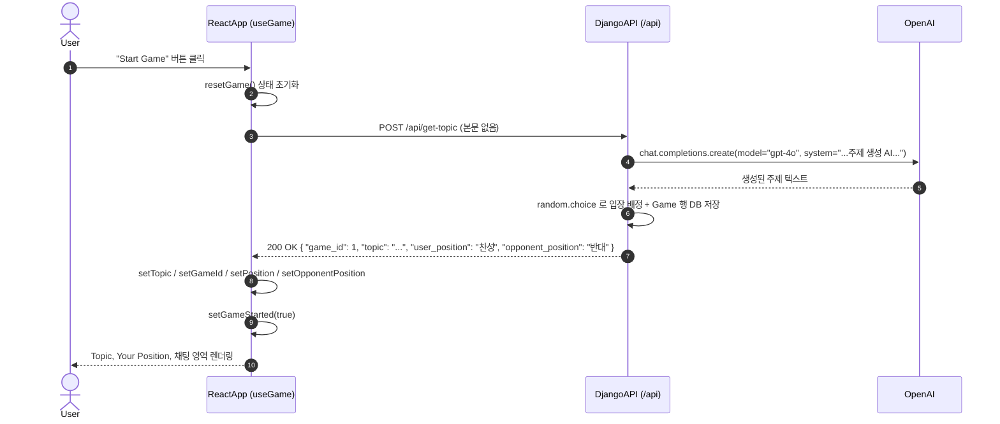
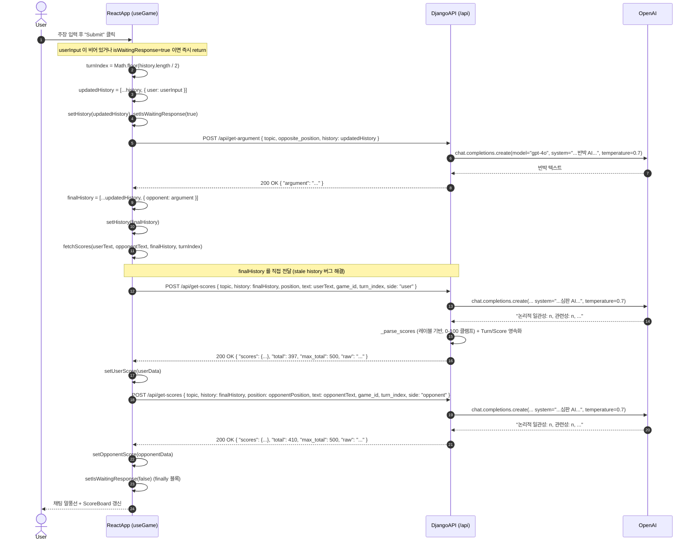
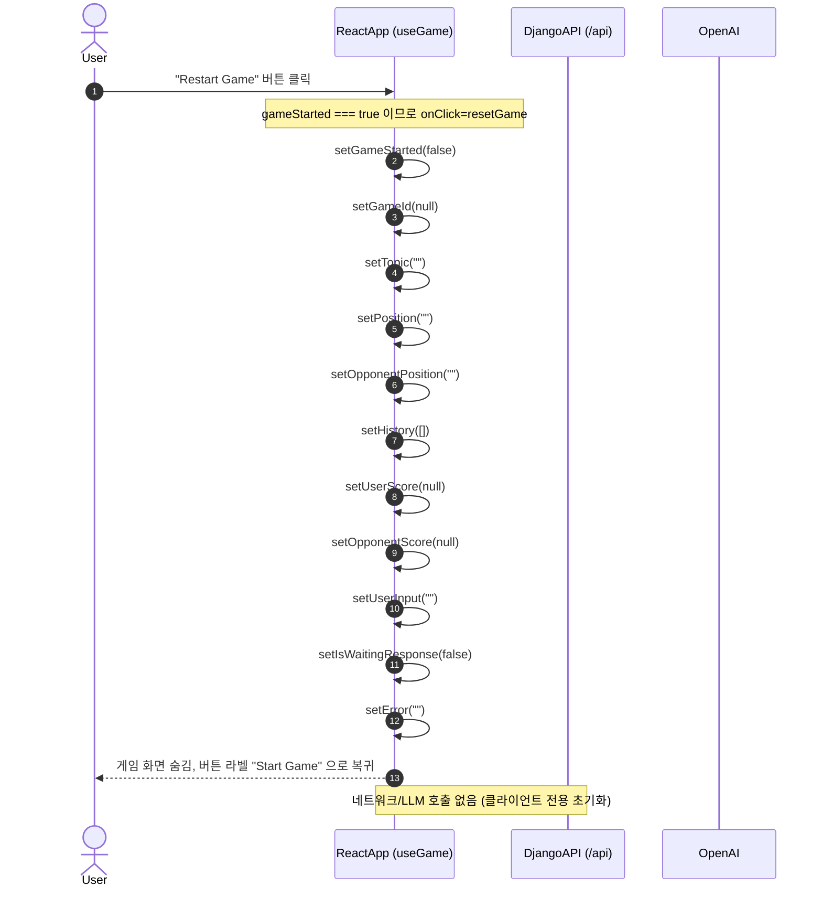

# ArguMind 시퀀스 다이어그램

이 문서는 ArguMind의 주요 시나리오를 시퀀스 다이어그램으로 설명합니다. 각 다이어그램의 참여자는 다음과 같습니다.

- **User**: 사람 사용자 (브라우저에서 버튼/입력을 조작)
- **ReactApp**: 프론트엔드 (`frontend/src/hooks/useGame.js` + 컴포넌트)
- **DjangoAPI**: Django REST Framework 백엔드 (`backend/api/views.py`, `backend/api/urls.py`)
- **OpenAI**: `gpt-4o` 모델 (`_OpenAIHelper.generate`를 통해 호출)

> 참고: `SERVER_URL = ''` 이므로 모든 API 호출은 동일 출처(same-origin)로 전송됩니다. 모든 엔드포인트는 `POST`, `permission_classes = [AllowAny]` 입니다(JWT는 전역 설정되어 있으나 이 엔드포인트들에서는 사용되지 않음).

---

## 1. 게임 시작 (startGame)

사용자가 "Start Game" 버튼을 누르면 `startGame()`이 실행됩니다. 먼저 `resetGame()`으로 상태를 초기화한 뒤 `/api/get-topic`으로 주제를 요청하고, 응답에 포함된 서버 배정 입장과 `game_id`를 상태에 저장합니다.



### 단계별 설명

1. 사용자가 "Start Game" 버튼을 클릭하면 `startGame()`이 호출됩니다 (`hooks/useGame.js`).
2. `startGame()`은 가장 먼저 `resetGame()`을 호출하여 모든 상태(11개)를 초기값으로 비웁니다.
3. ReactApp이 `POST /api/get-topic`을 **요청 본문 없이** 전송합니다.
4. `GetTopic.post()`가 고정된 프롬프트로 `_OpenAIHelper.generate()`를 호출하여 `gpt-4o`로부터 논쟁 주제를 생성합니다.
5. 백엔드가 **서버 측에서** `random.choice`로 입장을 배정하고 `Game` 행을 DB에 저장한 뒤 `{ game_id, topic, user_position, opponent_position }`을 응답합니다.
6. ReactApp이 응답에서 `topic`, `game_id`, `user_position`, `opponent_position`을 각 상태에 저장합니다. 클라이언트는 더 이상 `Math.random()`으로 입장을 배정하지 않습니다.
7. `setGameStarted(true)`로 게임 화면이 렌더링됩니다.

> 오류 처리: `get-topic` 호출이 실패하면 `catch`에서 `setError(...)`를 호출하여 `ErrorBanner`에 메시지가 표시됩니다. `setGameStarted(true)`는 실행되지 않습니다.

### 페이로드 예시

요청 (본문 없음)

```http
POST /api/get-topic
Content-Type: application/json
```

응답

```json
{
  "game_id": 1,
  "topic": "AI 기술의 발전이 인간의 창의성을 감소시킬 것이다.",
  "user_position": "찬성",
  "opponent_position": "반대"
}
```

---

## 2. 한 턴 진행 (submitArgument → get-argument → fetchScores)

사용자가 주장을 입력하고 "Submit"을 누르면 한 턴이 진행됩니다. 사용자 발언을 `history`에 추가하고, `/api/get-argument`로 AI 반박을 받아 다시 `history`에 추가한 뒤, `fetchScores()`에서 `/api/get-scores`를 **두 번**(사용자 → 상대) 호출하여 점수를 표시합니다.



### 단계별 설명

1. 사용자가 입력창에 주장을 적고 "Submit"을 클릭하면 `submitArgument()`가 호출됩니다 (`hooks/useGame.js`). `userInput`이 비어 있거나 `isWaitingResponse`가 `true`이면 즉시 `return`합니다.
2. `turnIndex = Math.floor(history.length / 2)`로 현재 턴 번호를 계산합니다(0-based).
3. 사용자 발언을 `{ user: userInput }` 형태로 `history`에 추가하여 `updatedHistory`를 만들고 `setHistory(updatedHistory)`, `setIsWaitingResponse(true)`를 호출합니다.
4. `POST /api/get-argument`를 `{ topic, opposite_position, history: updatedHistory }` 본문으로 호출합니다.
5. `gpt-4o`가 반박(`argument`)을 생성하여 `{ "argument": "..." }`로 응답합니다.
6. 응답을 `{ opponent: argument }`로 추가하여 `finalHistory`를 만들고 `setHistory(finalHistory)`로 반영합니다.
7. `fetchScores(submittedText, opponentArgument, finalHistory, turnIndex)`를 호출합니다. **`finalHistory`를 인자로 직접 전달**하므로 stale state 문제가 해결되었습니다.
8. `fetchScores()`는 사용자 주장에 대해 `POST /api/get-scores`를 호출합니다. `game_id`, `turn_index`, `side: "user"`를 함께 전송해 영속화를 트리거합니다.
9. 백엔드가 `_parse_scores(raw)`로 레이블 기반 파싱 후 `{ scores:{...}, total, max_total:500, raw }` 구조화 JSON을 반환합니다.
10. 동일하게 상대(AI)의 반박 텍스트에 대해 `side: "opponent"`로 `POST /api/get-scores`를 한 번 더 호출합니다.
11. `finally` 블록에서 `setIsWaitingResponse(false)`로 입력을 다시 활성화합니다. 오류 발생 시 `setError(...)`로 `ErrorBanner`에 메시지가 표시됩니다.

> **stale history 버그 수정**: `fetchScores`가 React state의 `history` 대신 `finalHistory`를 인자로 직접 받아 전달합니다. 심판 AI는 이제 이번 턴의 발언이 포함된 최신 대화 기록을 보고 채점합니다.

> **점수 파싱 개선**: 클라이언트의 `calculateTotalScore()` 정규식 합산이 제거되었습니다. 백엔드가 레이블 기반으로 파싱하여 구조화 JSON을 반환하며, `ScoreBoard` 컴포넌트가 이를 읽기 좋은 형식으로 표시합니다.

### 페이로드 예시

`POST /api/get-argument` 요청 본문

```json
{
  "topic": "AI 기술의 발전이 인간의 창의성을 감소시킬 것이다.",
  "opposite_position": "반대",
  "history": [
    { "user": "AI는 반복 작업을 대신해 인간이 더 창의적인 일에 집중하게 합니다." }
  ]
}
```

`POST /api/get-argument` 응답

```json
{
  "argument": "오히려 AI에 대한 의존이 심화되면 인간 스스로 사고할 기회가 줄어듭니다."
}
```

`POST /api/get-scores` 요청 본문 (사용자 발언 채점)

```json
{
  "topic": "AI 기술의 발전이 인간의 창의성을 감소시킬 것이다.",
  "history": [
    { "user": "AI는 반복 작업을 대신해 인간이 더 창의적인 일에 집중하게 합니다." },
    { "opponent": "오히려 AI에 대한 의존이 심화되면 인간 스스로 사고할 기회가 줄어듭니다." }
  ],
  "position": "찬성",
  "text": "AI는 반복 작업을 대신해 인간이 더 창의적인 일에 집중하게 합니다.",
  "game_id": 1,
  "turn_index": 0,
  "side": "user"
}
```

`POST /api/get-scores` 응답

```json
{
  "scores": {
    "logical_consistency": 82,
    "relevance": 90,
    "creativity": 75,
    "rebuttal": 70,
    "summarization": 80
  },
  "total": 397,
  "max_total": 500,
  "raw": "논리적 일관성: 82, 관련성: 90, 창의성: 75, 반박 효과: 70, 요약력: 80"
}
```

`ScoreBoard` 컴포넌트는 위 객체를 받아 `"논리적 일관성: 82, 관련성: 90, 창의성: 75, 반박 효과: 70, 요약력: 80, 총점: 397/500"` 형태로 표시합니다.

상대(AI) 채점 요청 본문은 `position`이 `opponentPosition`, `text`가 AI 반박 텍스트, `side`가 `"opponent"`인 점만 다릅니다.

---

## 3. 리스타트 (resetGame)

게임이 시작된 상태에서 버튼을 누르면 라벨이 "Restart Game"이며, 클릭 시 `resetGame()`이 호출됩니다. 이는 순수한 클라이언트 상태 초기화로, **백엔드/OpenAI 호출이 전혀 발생하지 않습니다.**



### 단계별 설명

1. `gameStarted`가 `true`일 때 버튼 라벨은 "Restart Game"이며, `onClick` 핸들러는 `resetGame`입니다 (`hooks/useGame.js`).
2. `resetGame()`은 11개 상태(`gameStarted`, `gameId`, `topic`, `position`, `opponentPosition`, `history`, `userScore`, `opponentScore`, `userInput`, `isWaitingResponse`, `error`)를 모두 초기값으로 되돌립니다.
3. 어떤 API도 호출하지 않으므로 네트워크/LLM 비용이 발생하지 않습니다.
4. `gameStarted`가 `false`가 되어 주제·채팅·점수 영역이 화면에서 사라지고 버튼 라벨이 "Start Game"으로 돌아갑니다.

> `opponentPosition`, `gameId`, `error`가 이제 `resetGame()`에서 명시적으로 초기화됩니다(이전에는 `opponentPosition`이 누락되어 있었습니다).

> 영속성: 서버에 저장된 `Game`/`Turn`/`Score` 기록은 리스타트해도 삭제되지 않습니다. 리스타트는 클라이언트 상태만 초기화합니다.
