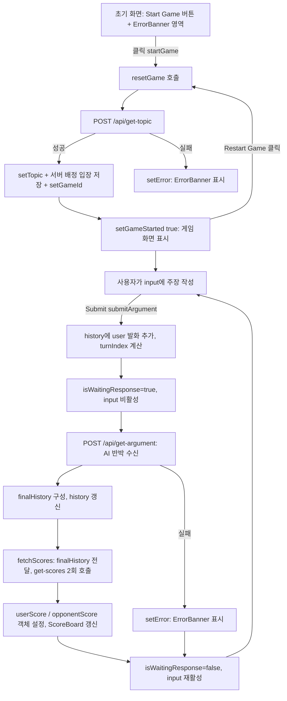
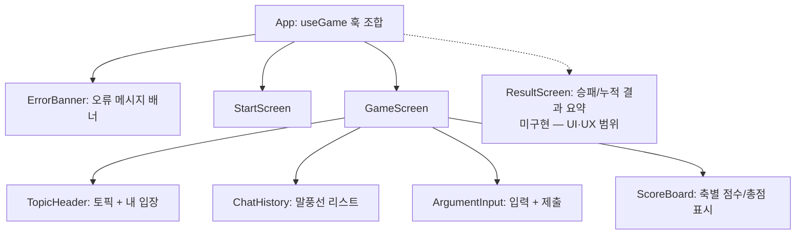

# ArguMind 와이어프레임 (UI 명세)

본 문서는 `frontend/src/App.js` 단일 컴포넌트로 구성된 현재 UI를 ASCII 와이어프레임으로 표현하고, 각 UI 요소의 역할/스타일/연결 상태를 정리한다. 모든 스타일은 **인라인 스타일**로만 작성되어 있으며, 별도의 CSS 클래스나 디자인 시스템은 사용되지 않는다(`App.css`, `index.css`는 존재하나 컴포넌트에서 활용하지 않음).

> 기준 파일: `frontend/src/hooks/useGame.js` (상태·로직) + `frontend/src/components/` (StartScreen, GameScreen, TopicHeader, ChatHistory, ArgumentInput, ScoreBoard, ErrorBanner) + `frontend/src/App.js` (조합)
> 라우터 없음 / 상태 관리 라이브러리 없음 / 화면은 조건부 렌더링(`gameStarted`)으로 단일 페이지 내에서 전환.

---

## 1. 시작 전 상태 (gameStarted === false)

게임 시작 전에는 외곽 컨테이너와 단 하나의 버튼만 렌더링된다. 토픽/입장/채팅/점수 영역은 `{gameStarted && (...)}` 조건 안에 있으므로 표시되지 않는다.

```
┌───────────────────────────────────────────────────────────┐
│  (div: fontFamily Arial, padding 20px)                     │
│                                                            │
│   ┌──────────────────┐                                     │
│   │   Start Game      │   ← <button>                        │
│   └──────────────────┘                                     │
│                                                            │
│   (이 외에는 아무것도 렌더링되지 않음)                       │
│                                                            │
└───────────────────────────────────────────────────────────┘
```

- 버튼 클릭 시 `startGame()` 실행 → `/api/get-topic` 호출 → 토픽 설정 + **서버 배정** 입장 수신(`user_position`, `opponent_position`) → `setGameStarted(true)`.
- 토픽 요청이 실패하면 `catch`에서 `setError(...)`를 호출하여 `ErrorBanner`에 오류 메시지가 표시된다. `setGameStarted(true)`는 실행되지 않는다.

---

## 2. 게임 진행 상태 (gameStarted === true)

게임이 시작되면 버튼 라벨이 `Restart Game`으로 바뀌고, 토픽 / 내 입장 / 스크롤 채팅 영역 / 입력창 + 제출 버튼 / 점수 영역이 순서대로 렌더링된다.

```
┌───────────────────────────────────────────────────────────┐
│  (div: fontFamily Arial, padding 20px)                     │
│                                                            │
│   ┌──────────────────┐                                     │
│   │   Restart Game    │   ← <button> (onClick=resetGame)    │
│   └──────────────────┘                                     │
│                                                            │
│   Topic: {topic}                          ← <h2>            │
│   Your Position: {position}               ← <h3> (찬성/반대) │
│                                                            │
│   ┌─────────────────────────────────────────────────────┐ │
│   │ (채팅 히스토리: maxHeight 300px, overflowY scroll)    │ │
│   │ border 1px #ccc, padding 10px                         │ │
│   │                                                       │ │
│   │                          ┌────────────────────────┐  │ │
│   │           (user, 우측정렬) │ 사용자 주장 #d4f4fa     │  │ │
│   │                          └────────────────────────┘  │ │
│   │  ┌────────────────────────┐                          │ │
│   │  │ AI 반박 #f4d4fa         │ (opponent, 좌측정렬)      │ │
│   │  └────────────────────────┘                          │ │
│   │                          ┌────────────────────────┐  │ │
│   │                          │ 사용자 주장 #d4f4fa     │  │ │
│   │                          └────────────────────────┘  │ │
│   │              ...(history 배열 순서대로 반복)...        │ │
│   └─────────────────────────────────────────────────────┘ │
│                                                            │
│   ┌───────────────────────────────────────┐ ┌──────────┐  │
│   │ Enter your argument...   (input 80%)   │ │  Submit  │  │
│   └───────────────────────────────────────┘ └──────────┘  │
│        ↑ isWaitingResponse=true 동안 input disabled         │
│                                                            │
│   User Score: {userScore ?? "N/A"}        ← <h4>           │
│   Opponent Score: {opponentScore ?? "N/A"}← <h4>           │
│                                                            │
└───────────────────────────────────────────────────────────┘
```

채팅 말풍선 정렬/색상은 항목이 `user` 키인지 `opponent` 키인지에 따라 결정된다.

| 발화 주체 | 정렬 | 배경색 | 판별 조건 |
|---|---|---|---|
| 사용자(user) | 우측(`textAlign: right`) | `#d4f4fa` (하늘색) | `entry.user` truthy |
| AI 상대(opponent) | 좌측(`textAlign: left`) | `#f4d4fa` (연분홍) | `entry.user` falsy |

---

## 3. UI 요소 정리표

| 요소명 | 컴포넌트 | 역할 | 현재 스타일(인라인) | 연결된 상태 / 핸들러 |
|---|---|---|---|---|
| 외곽 `<div>` | `App` | 전체 페이지 컨테이너 | `fontFamily: Arial, sans-serif; padding: 20px` | 없음 (정적) |
| `ErrorBanner` | `ErrorBanner` | API 오류 메시지 표시 + 닫기 | `role="alert"` 배너 | `error` 상태; 닫기 버튼 → `dismissError()` |
| Start/Restart `<button>` | `StartScreen` / `GameScreen` | 게임 시작 또는 초기화 | 스타일 없음(브라우저 기본) | `onClick = gameStarted ? resetGame : startGame`; 라벨은 `gameStarted`로 분기 |
| Topic `<h2>` | `TopicHeader` | AI 생성 토론 주제 표시 | 스타일 없음 | `topic` 상태 |
| Your Position `<h3>` | `TopicHeader` | 사용자 입장(찬성/반대) 표시 | 스타일 없음 | `position` 상태 (서버 배정값) |
| 채팅 히스토리 `<div>` | `ChatHistory` | 사용자/AI 발화 누적 표시 | `maxHeight: 300px; overflowY: scroll; border: 1px solid #ccc; padding: 10px; margin: 10px 0` | `history` 배열을 `.map`으로 렌더 |
| 발화 행 `<div>` (반복) | `ChatHistory` | 한 발화의 정렬 래퍼 | `textAlign: user?right:left; margin: 5px 0` | `history[i]` |
| 말풍선 `<span>` (반복) | `ChatHistory` | 발화 텍스트 박스 | `display: inline-block; padding: 10px; backgroundColor: user?#d4f4fa:#f4d4fa; borderRadius: 5px` | `entry.user || entry.opponent` |
| 주장 입력 `<input>` | `ArgumentInput` | 사용자 주장 입력 | `width: 80%; padding: 10px; marginRight: 10px` | `value=userInput`; `onChange→setUserInput`; `disabled=isWaitingResponse` |
| Submit `<button>` | `ArgumentInput` | 주장 제출 | `padding: 10px` | `onClick = submitArgument` (※ `disabled` 미적용 — UI·UX 범위) |
| User Score | `ScoreBoard` | 사용자 채점 결과 | 스타일 없음 | `userScore` 객체를 "축: n, ..., 총점: x/500" 문자열로 포맷 (null이면 "N/A") |
| Opponent Score | `ScoreBoard` | AI 채점 결과 | 스타일 없음 | `opponentScore` 객체 (null이면 "N/A") |

> 참고: `input`에는 `disabled={isWaitingResponse}`가 걸려 있으나 **Submit 버튼에는 `disabled`가 없다.** `submitArgument()` 첫 줄에서 `isWaitingResponse` 체크로 중복 제출을 방지하지만, 버튼 시각적 비활성화는 UI·UX 범위로 남겨졌다.

---

## 4. 사용자 흐름 (UX 단계)



단계 서술:

1. **진입** — 사용자는 `Start Game` 버튼과 오류 시 표시될 `ErrorBanner` 영역을 본다.
2. **게임 시작** — 버튼 클릭 시 `resetGame()`으로 상태를 비운 뒤 토픽을 받아온다. 입장은 **서버가 배정**하며, 응답의 `user_position`/`opponent_position`을 상태에 저장한다. 실패 시 `ErrorBanner`에 메시지가 표시된다.
3. **토론 화면 노출** — 토픽, 내 입장, 빈 채팅창, 입력창, 점수(N/A)가 표시된다.
4. **주장 제출** — 사용자가 텍스트를 입력하고 `Submit`을 누르면 발화가 채팅 히스토리에 추가되고 입력창이 비활성화된다.
5. **AI 반박 수신** — `/api/get-argument`로 상대 입장 기반 반박을 받아 `finalHistory`에 추가한다.
6. **채점** — `/api/get-scores`를 사용자/상대 각각에 대해 호출하여 구조화 점수 객체를 받고, `ScoreBoard`가 5개 축과 총점(`총점: x/500`)을 표시한다.
7. **반복** — 입력창이 다시 활성화되고 같은 화면에서 다음 턴을 이어간다(턴 제한 없음).
8. **재시작** — `Restart Game`을 누르면 `resetGame()`으로 모든 상태(11개)가 초기화되며 시작 전 상태로 돌아간다.

---

## 5. 현재 UX 문제점

- **로딩 피드백 부족** (미해결 — UI·UX 범위): `isWaitingResponse`는 input `disabled`에만 반영되고, 스피너/로딩 텍스트/진행 표시가 없다. AI 응답과 채점에는 LLM 호출 3회(get-argument 1 + get-scores 2)가 직렬로 일어나 수 초가 걸릴 수 있으나 사용자는 아무 시각적 단서를 받지 못한다.
- ~~**에러 화면 없음**~~ **(해결)**: `ErrorBanner` 컴포넌트(`role="alert"`, 닫기 버튼)가 추가되어 `startGame`, `submitArgument` 실패 시 오류 메시지가 화면에 표시된다.
- **채점 결과 시각화 부재** (미해결 — UI·UX 범위): `ScoreBoard`가 5개 축 값을 텍스트 문자열로 표시하며 막대/차트 시각화는 없다. (단, 정규식 합산 취약성은 백엔드 구조화 응답으로 해결됨.)
- **게임 종료/승패 개념 없음** (미해결 — UI·UX 범위): 턴 수 제한, 누적 점수, 승패 판정, 결과 요약 화면이 없다. 토론은 무한히 이어질 수 있고, 매 턴 점수는 직전 턴 값으로 덮어써져 누적되지 않는다.
- **점수 누적/비교 부재** (미해결 — UI·UX 범위): `userScore`/`opponentScore`는 항상 최신 1턴 값만 유지하므로 라운드별 추이나 누계를 볼 수 없다.
- ~~**점수 채점 데이터 불일치(stale history)**~~ **(해결)**: `fetchScores`가 이제 `finalHistory`를 직접 인자로 받아 전달한다. 채점 문맥 뒤처짐 버그가 수정되었다.
- **접근성/반응형 미고려** (미해결 — UI·UX 범위): 인라인 고정 픽셀(`width 80%`, `maxHeight 300px` 등), 영어 placeholder/라벨과 한국어 콘텐츠 혼용, 라벨 연결(`<label>`)·키보드 Enter 제출·포커스 관리 등이 없다.
- **시각적 정체성 부재** (미해결 — UI·UX 범위): 버튼/제목/점수에 스타일이 거의 없어 브라우저 기본 모양에 가깝다. 디자인 토큰이나 일관된 레이아웃 시스템이 없다.

---

## 6. 화면 분해 현황

단일 `App` 컴포넌트(상태 9개 + 핸들러 + 인라인 렌더링)의 분해가 **이번 리팩토링에서 구현되었다.**



| 컴포넌트 | 책임 | 구현 상태 |
|---|---|---|
| `ErrorBanner` | `error` 상태를 `role="alert"` 배너로 표시, 닫기 버튼 | **구현됨** |
| `StartScreen` | 시작 버튼, 게임 시작 트리거 | **구현됨** |
| `GameScreen` | 진행 중 화면 조립(헤더/채팅/입력/점수) | **구현됨** |
| `TopicHeader` | 토픽·내 입장 표시 | **구현됨** |
| `ChatHistory` | `history` 배열을 말풍선으로 렌더 | **구현됨** |
| `ArgumentInput` | 입력 상태, 제출, 대기 중 input 비활성 | **구현됨** |
| `ScoreBoard` | 구조화 점수 객체를 "축: n, ..., 총점: x/500" 문자열로 포맷 | **구현됨** |
| `ResultScreen` | 턴 종료/승패 판정/누적 점수 요약 | **미구현** — UI·UX 범위 |

`useGame` 훅(`frontend/src/hooks/useGame.js`)이 상태(11개)와 로직(`startGame`, `resetGame`, `submitArgument`, `fetchScores`, `dismissError`)을 모두 보유하며, 컴포넌트는 순수 프레젠테이션 역할을 한다. `fetch` 로직은 `frontend/src/api/client.js`로 분리되었다.
